# 多源外部特征与 TFT 融合的共享单车需求预测与智能调度系统

学生姓名：吴天一

学号：202283250010

专业：数据科学与大数据技术

学院：未来技术学院

指导教师：胡伟

## 摘要

共享单车站点需求受通勤规律、天气、节假日、周边 POI 和站点间流动关系共同影响，易产生缺车和满站问题。本文基于 NYC Citi Bike 2022 年数据构建小时级站点面板，融合天气、时间、POI、历史模式和训练期 OD 图，选取覆盖约 90% 流量的 883 个站点，完成过去 12 小时预测未来 12 小时出发量和到达量。预测层面，本文比较 AGCRN、Graph WaveNet 及外部时空模型，并实现 TFT-style 分位数预测模块。TFT-style q50 平均 MAE 为 1.5899，q10-q90 PICP80 为 0.8107；Graph WaveNet（目标时间特征与净流量辅助损失）平均 MAE 为 1.6238，净流量 MAE 为 1.5658。调度层面，本文设计滚动库存模拟和最小费用流再平衡算法，在每小时 200 辆搬运上限下生成取放任务。回测表明，预测驱动调度能够显著降低库存越界小时，同时也说明预测 MAE 与调度效果并非完全一致。最后，本文实现离线可视化平台，用于展示预测区间、库存风险和调度路线。

关键词：共享单车；需求预测；TFT；时空图神经网络；车辆再平衡调度

## Abstract

Bike-sharing systems play an important role in urban short-distance mobility and last-mile public transport connection. However, station-level demand is affected by commuting patterns, weather conditions, holidays, surrounding points of interest, and inter-station flow relations, which often leads to local bike shortages and dock saturation. To improve demand forecasting and connect forecasts with operational decisions, this thesis builds an hourly station-level dataset based on 2022 NYC Citi Bike data. The dataset integrates weather features, calendar features, station attributes, POI features, and OD relation graphs, covering 883 stations that account for about 90% of annual trip volume. For forecasting, this thesis compares multiple spatio-temporal models including AGCRN, Graph WaveNet, CCRNN, ESG, and GMRL, and implements a TFT-style quantile forecasting module that outputs q10, q50, and q90 multi-horizon forecasts. The TFT-style model achieves an average q50 MAE of 1.5899 and a q10-q90 PICP80 of 0.8107, while the Graph WaveNet model with target-time features and a net-flow auxiliary loss achieves an average MAE of 1.6238 and a net-flow MAE of 1.5658. For rebalancing, this thesis designs a rolling-horizon inventory simulator and a minimum-cost flow relocation algorithm, converting predicted net flow into pickup and drop-off tasks under a cap of 200 moved bikes per hourly decision. Backtesting results show that forecast-driven rebalancing substantially reduces boundary violation hours compared with no rebalancing, while also revealing that lower forecasting MAE does not always imply better dispatching performance. Finally, an offline visualization system based on FastAPI and React is implemented to support model comparison, route visualization, station-level inventory analysis, and quantile interval display.

Key Words: bike sharing; demand forecasting; TFT; spatio-temporal graph neural network; bike rebalancing

## 目录

1. 绪论
2. 相关技术与研究现状
3. 数据集构建与多源特征工程
4. 共享单车需求预测模型设计
5. 预测驱动的智能再平衡调度算法
6. 系统设计与实现
7. 实验结果与分析
8. 总结与展望
9. 参考文献
10. 致谢
11. 附录

## 1 绪论

### 1.1 研究背景

共享单车是城市慢行交通体系的重要组成部分，能够降低短距离出行成本，缓解公共交通站点到最终目的地之间的“最后一公里”问题。在高密度城市区域中，共享单车既可以作为地铁、公交等公共交通方式的补充，也可以在中短距离通勤、休闲出行和临时出行场景中独立发挥作用。随着系统规模扩大，运营方需要在大量站点之间动态调配车辆，使用户在需要用车时有车可借，在到达目的地时有空位可还。

共享单车运营中的关键矛盾是供需时空不均衡。早高峰时，住宅区站点常出现车辆快速流出，商务区和轨道交通站点周边可能出现车辆快速流入；晚高峰则呈现相反趋势。天气、节假日、工作日与周末差异、周边餐饮和办公设施密度、临时活动等因素都会改变局部需求。若运营方只依据静态规则或人工经验调度车辆，容易出现两类问题：一是缺车，用户到达站点后无法借车；二是满站，用户骑行到达后无法还车。这两类问题都会降低服务质量，并增加调度车辆的空驶和重复调度成本。

需求预测是解决调度问题的前置环节。相比只根据当前库存进行反应式调度，预测驱动调度可以提前估计未来几个小时的车辆流入与流出，从而在缺车或满站发生前进行干预。尤其对于共享单车这种具有明显周期性和局部突发性的系统，若模型能够同时建模时间规律、空间关系和多源外部特征，就可以为调度算法提供更稳定的未来库存变化估计。

近年来，深度学习和时空图神经网络在交通预测领域得到广泛应用。图神经网络能够刻画站点或路网节点之间的空间依赖，时序卷积和注意力机制能够捕获多尺度时间规律。Temporal Fusion Transformer（TFT）进一步提供了处理静态特征、历史时变特征、未来已知特征和分位数预测的建模思路，适合需要不确定性表达的多步预测任务。本文围绕共享单车需求预测与调度一体化问题，构建从数据、模型、调度算法到可视化平台的完整研究框架。

### 1.2 研究意义

从理论角度看，共享单车站点级需求预测属于典型的多变量时空序列建模问题。站点需求不仅有日周期、周周期和季节性，还受到天气、POI、节假日和站点间流动关系影响。本文通过对 AGCRN、Graph WaveNet、TFT-style 分位数模型等方法进行统一数据口径下的实验比较，可以分析不同模型结构和特征来源在共享单车预测任务中的作用。

从实践应用角度看，单纯提高预测 MAE 并不能直接代表运营效果改善。调度算法真正关心的是未来库存是否落入安全区间、搬运成本是否可接受以及调度动作是否现实可执行。本文将预测结果接入滚动时域库存模拟和最小费用流调度算法，比较无调度、理想预测调度和预测驱动调度的差异，可以形成“预测—调度—评估”的闭环。

从系统应用角度看，本文实现的离线可视化平台能够展示站点地图、预测曲线、风险区间、调度路线和库存变化，为结果分析和后续系统扩展提供直观依据。虽然本文系统基于历史数据回测，不接实时库存和在线天气，但其结构为未来接入实时数据、调度任务派发和多城市迁移提供了基础。

### 1.3 研究内容

本文主要研究内容包括以下五个方面。

第一，构建共享单车多源数据集。本文以纽约 Citi Bike 2022 年历史订单为基础[1]，将原始行程数据聚合为站点小时级出发量、到达量和净流量，并融合 Open-Meteo 天气数据[2]、日历特征、站点静态属性、OpenStreetMap POI 特征[3]和训练期 OD 关系图。主实验使用全年流量覆盖约 90% 的 883 个站点，输入窗口为过去 12 小时，预测窗口为未来 12 小时。

第二，设计并比较多种需求预测模型。本文以 AGCRN 作为基准模型出发，依次研究地理距离图、OD 关系图、目标变换、Graph WaveNet 结构、未来目标时间特征和净流量辅助损失的影响，并适配 CCRNN、ESG、GMRL 等外部论文模型作为对照。在此基础上，本文实现 TFT-style 分位数预测模块，输出 q10、q50、q90 需求预测区间。

第三，构建预测驱动调度算法。本文设计基于库存安全带的滚动时域调度框架，根据未来净流量预测推演站点库存，识别缺车站和溢车站，并将取放匹配建模为最小费用流问题。算法以搬运距离为费用，在每小时最多搬运 200 辆车的约束下生成可执行的站点间调度方案。

第四，实现离线回测可视化平台。平台后端基于 FastAPI，负责组织历史数据、模型预测结果和调度结果；前端基于 React、MapLibre 和 ECharts，展示站点地图、调度路径、聚合净流量、库存边界和单站详情。平台支持 TFT-style、Graph WaveNet 和理想预测等预测源切换，也支持贪心匹配与最小费用流两类调度算法对比。

第五，进行实验评估与结果分析。预测实验使用 MAE、RMSE、MAPE、Pinball Loss、PICP 和区间宽度等指标；调度实验使用空站小时、满站小时、安全库存带上下界违规小时、总搬运车辆数、调度动作数和 车辆搬运里程 等指标。实验重点分析预测精度、预测不确定性和调度效果之间的关系。

### 1.4 论文结构

本文共分为八章。第一章介绍研究背景、意义、内容和结构。第二章综述共享单车需求预测、时空图神经网络、TFT 分位数预测和车辆再平衡调度相关工作。第三章介绍数据来源、数据清洗、站点选择、特征构建和数据划分。第四章介绍需求预测模型设计，包括 Graph WaveNet（目标时间特征与净流量辅助损失）和 TFT-style 分位数模块。第五章介绍预测驱动的再平衡调度算法。第六章介绍系统架构和可视化平台实现。第七章给出实验设置、预测结果、调度结果和可解释性分析。第八章总结全文并讨论不足与展望。

## 2 相关技术与研究现状

### 2.1 共享单车需求预测研究

共享单车需求预测通常可以分为城市整体需求预测、区域网格需求预测和站点级需求预测。城市整体预测关注总租还量变化，适合宏观趋势分析；区域网格预测将城市划分为空间单元，适合热力图展示；站点级预测直接服务于车辆调度和站点运维，是本文关注的主要任务。

早期研究多采用历史均值、移动平均、ARIMA、Prophet 等传统时间序列方法[4]。这类方法结构清晰、可解释性强，但难以充分建模复杂的非线性关系和多源外部因素。随后，随机森林、XGBoost、LightGBM 等机器学习方法被用于融合天气、时间和空间统计特征，在中小规模任务上具有较好效果。深度学习方法进一步引入 LSTM、GRU、TCN、Transformer 等结构，可以从大量历史序列中自动学习非线性模式[5-8]。

共享单车需求的难点在于稀疏性和异质性。许多站点在某些小时需求为零或很低，热门站点又可能出现长尾高峰；同一时刻不同区域的流入和流出方向可能完全不同。因此，模型不仅需要预测出发量和到达量，还需要准确捕获二者差值，即净流量。对于调度而言，净流量直接决定未来库存变化，比单独的出发量或到达量更贴近决策目标。

从任务粒度看，站点级预测比区域级预测更难，但也更贴近调度决策。区域级模型可以通过空间聚合降低噪声，但会丢失具体站点的容量、位置和借还约束；站点级模型需要面对大量低流量节点和强烈的站点差异，却能直接输出每个站点未来的供需变化。本文选择站点级建模，是因为后续调度算法需要明确知道哪些站点应取车、哪些站点应补车以及各站点的取放数量。如果只预测区域总需求，还需要额外将区域需求拆分到站点，反而会引入新的分配误差。

近年的共享单车需求预测研究已经开始结合时空注意力、图卷积、天气与 POI 等多源信息。例如 TAGCN 和 STGA-LSTM 均强调站点间空间依赖与时间注意力，空间时间聚合图神经网络和跨交通方式图神经网络则进一步将站点聚类、多模式交通关系纳入需求预测[19-22]。这些工作说明共享单车预测已从单站时间序列建模转向多源时空关系建模，本文的数据集构建和模型选择也沿着这一方向展开。

从预测形式看，已有研究既包括点预测，也包括概率预测和区间预测。点预测便于评价 MAE、RMSE 等指标，并能直接作为调度算法输入；概率预测或分位数预测则能够描述不确定性，适合运营方根据风险偏好调整调度策略[9-10]。共享单车需求具有明显随机波动，尤其在低流量站点和特殊天气时段，单一点预测难以表达模型对未来状态的把握程度。因此，本文在点预测主线之外，引入 q10、q50、q90 分位数预测，用于补充风险感知分析。

### 2.2 时空图神经网络

交通系统天然具有图结构。道路传感器、公交站点和共享单车站点都可以被视为图上的节点，节点之间的空间依赖可以由距离、道路连接、OD 流量或功能相似性定义。图神经网络通过邻接矩阵或自适应图结构聚合邻居信息，在交通速度预测和出行需求预测中应用广泛。

Diffusion Convolutional Recurrent Neural Network（DCRNN）将扩散图卷积与循环网络结合，用于建模交通网络中的空间传播和时间演化[11]。Spatio-Temporal Graph Convolutional Network（STGCN）使用图卷积和时序卷积替代循环结构，提高训练效率[12]。Adaptive Graph Convolutional Recurrent Network（AGCRN）通过节点嵌入学习自适应邻接矩阵，减少对人工图结构的依赖[13]。Graph WaveNet 进一步将自适应图卷积与扩张因果卷积结合，通过指数增长的感受野捕获多尺度时间依赖[14]。

本文在实验中发现，单纯使用站点地理距离构造 kNN 图并不一定改善共享单车预测效果。原因在于共享单车站点之间的关系并不只由地理邻近决定，通勤方向、功能区、地铁接驳和 OD 流动都可能比直线距离更重要。因此，本文使用训练期 OD 流量构造 top-k 关系图，并将其作为 Graph WaveNet 的辅助空间先验。

时空图模型的一个关键问题是图结构来源。若图结构来自道路拓扑或传感器距离，其含义清晰，但不一定反映共享单车需求的真实相互影响；若图结构完全由模型自适应学习，表达能力更强，但可解释性较弱，也可能需要更多数据才能稳定收敛。近年的 CCRNN、ESG、GMRL 和 ReMo 等模型分别从动态图耦合、多尺度图结构、张量表示和细粒度关系建模角度扩展了多变量时序预测方法[15-18]。本文采用折中方案：保留自适应图作为主要关系表达，同时引入训练期 OD top-k 图作为辅助先验。这样既避免将“地理距离近”等同于“需求相关”，也避免将测试期流向信息泄漏到训练阶段。

### 2.3 TFT 与分位数预测

Temporal Fusion Transformer 是一种面向多步时序预测的深度模型，能够融合静态协变量、历史时变输入和未来已知输入，并通过注意力机制和变量选择机制增强可解释性[9]。TFT 的一个重要特点是支持分位数预测，即不只输出单一点估计，还输出不同置信水平下的预测值[10]。对于共享单车调度而言，预测区间可以表达未来需求的不确定性，为保守或激进的调度策略提供输入。

本文实现的是 TFT-style 分位数模块，而不是对官方 PyTorch Forecasting TFT 的完全复现。这样做的原因是本文任务采用多站点密集张量口径，与官方库常见的长表序列输入形式存在差异。本文模块保留 TFT 思想中的多源特征融合、未来已知时间输入、注意力和分位数损失，使用 q10、q50、q90 三个分位数描述未来出发量和到达量区间。

分位数预测使用 Pinball Loss。对于分位数水平 q，真实值 y 和预测值 y_hat 的损失可以写为：

$$
L_q(y, \hat{y}) = \max(q(y-\hat{y}), (q-1)(y-\hat{y}))
$$

当预测值低于真实值时，损失按照 q 加权；当预测值高于真实值时，损失按照 1-q 加权。多个分位数的总损失为各分位数损失的平均值。本文使用 q10-q90 的区间覆盖率 PICP80 和平均区间宽度评价不确定性预测质量。

需要注意的是，分位数预测的评价不能只看区间覆盖率。如果区间过宽，即使覆盖率较高，也难以为调度提供有效信息；如果区间过窄，覆盖率不足，则说明模型低估了不确定性。本文同时报告 PICP80 和平均区间宽度，目的就是在“覆盖真实值”和“保持区间紧凑”之间进行平衡。最终实验中，TFT-style 模型的 PICP80 为 0.8107，接近理论 80% 区间目标，说明区间校准较为合理。

### 2.4 车辆再平衡调度

共享单车再平衡调度通常指运营方使用货车或人工方式在站点之间搬运车辆，以缓解缺车和满站问题。调度问题可以被建模为车辆路径问题、容量约束车辆路径问题或带时间窗的路径规划问题[23]。完整 VRP 能够描述车辆容量、路径顺序、服务时间和多车协同，但建模和求解复杂度较高。结合本科毕业设计的研究范围，本文优先关注“站点间应搬多少车”的任务生成与匹配问题，再将路径规划作为后续扩展方向。

本文使用滚动时域框架。每个决策时刻，系统读取当前库存，并根据未来 12 小时净流量预测推演库存变化。如果某站点未来库存低于安全下界，则视为需求站点；如果高于安全上界，则视为供给站点。随后，算法在供给站点和需求站点之间进行匹配。贪心算法优先选择距离近的供需对，简单可解释；最小费用流算法从全局角度最小化总搬运里程，更适合作为主调度算法[24]。

在实际运营中，调度算法还需要考虑货车数量、司机班次、道路通行时间、服务时间窗和站点临时不可达等因素。已有共享单车调度研究也开始结合需求不确定性、动态再平衡和鲁棒优化建模[25-28]。本文没有直接求解完整车辆路径问题，而是将问题拆分为两个层次：第一层决定每个决策时刻应该在站点之间搬运多少车；第二层才是多辆调度车如何执行这些任务。本文聚焦第一层，是因为需求预测与库存风险主要作用在站点供需层面，而完整 VRP 会显著增加建模复杂度，不利于在本科毕业设计中清晰展示预测驱动调度的核心逻辑。

### 2.5 可视化系统

交通预测和调度结果具有明显的空间属性，仅使用表格难以展示站点分布、调度路线和局部风险。因此，本文实现离线可视化平台，以地图、曲线和指标卡的形式展示模型预测与调度结果。平台采用前后端分离架构，后端负责模型和数据计算，前端负责交互展示。该系统不接入实时 API，而是基于 2022 年历史数据进行回测，目的在于展示算法链路和实验结果。

可视化系统在本文中不仅承担结果展示作用，也承担实验分析作用。通过地图可以观察调度任务是否集中在少数区域，通过聚合净流量曲线可以发现模型是否存在峰谷相位偏移，通过单站库存曲线可以检查某个站点的预测误差如何传导为缺车或满站风险。本文在模型分析过程中发现 Graph WaveNet 基础模型在部分时段存在净流量相位偏移，进而设计了未来目标时间特征和净流量辅助损失。因此，可视化平台也是模型解释和结果分析的重要工具。

### 2.6 本章小结

本章从共享单车需求预测、时空图神经网络、TFT 分位数预测、车辆再平衡调度和可视化系统五个方面梳理了相关技术。已有研究为本文提供了三点启发：一是共享单车需求预测需要同时考虑时间周期、外部因素和空间依赖；二是图神经网络和注意力机制适合处理多站点多步长预测，但图结构来源需要结合业务含义谨慎设计；三是预测模型应进一步服务于调度决策，不能只停留在离线误差指标比较。基于这些认识，本文后续章节将围绕“多源数据构建、TFT-style 分位数预测、最小费用流调度和离线可视化平台”展开。

## 3 数据集构建与多源特征工程

### 3.1 数据来源

本文使用的核心数据为纽约 Citi Bike 2022 年 1 月至 12 月订单数据[1]。原始订单记录包含骑行开始时间、结束时间、起点站、终点站、站点经纬度和骑行类型等信息。为了构建站点级预测任务，本文将订单聚合到小时粒度，分别统计每个站点每小时的出发量 出发量 和到达量 到达量，并定义净流量：

$$
net\_flow_{t,i}=arr\_count_{t,i}-dep\_count_{t,i}
$$

其中 t 表示小时，i 表示站点。净流量为正表示该小时站点车辆增加，为负表示车辆减少。

天气数据来自 Open-Meteo Historical Weather API，时间范围覆盖 2022-01-01 至 2023-01-02，粒度为小时级[2]。天气特征包括温度、降水、风速等，可与站点小时面板按时间对齐。POI 数据来自 OpenStreetMap，通过 Overpass API 下载纽约区域内的教育、餐饮、医疗、休闲、办公、零售和交通设施等元素[3]，并基于站点 500 米缓冲区进行聚合。站点间关系图由训练期订单构造，只使用训练时间窗口内的 OD 流量，避免验证集和测试集信息泄漏。

原始订单数据在进入建模前需要进行清洗和标准化处理。首先，剔除缺少起点站、终点站、开始时间或结束时间的无效记录；其次，将站点 ID、站点名称和经纬度统一到同一套站点索引，解决同一站点在不同月份文件中可能出现字段格式不一致的问题；再次，将骑行开始时间和结束时间分别向下取整到小时，用于统计出发量和到达量。对于跨小时骑行，本文不按骑行持续时间拆分，而是将其记入开始小时的出发量和结束小时的到达量，这与站点库存变化的实际发生时刻一致。

数据对齐的核心是保证所有特征在相同的站点-小时索引上可用。订单聚合后形成完整的 ts × 站点索引 面板，缺失站点小时补零，表示该小时没有观测到租还事件。天气数据本身为城市级小时序列，因此复制到所有站点；POI 和站点经纬度为静态特征，在时间维度上保持不变；历史滞后和滚动特征只使用当前时刻之前的数据计算，避免把未来需求泄漏到输入特征中。

### 3.2 站点选择与时间窗口

纽约 Citi Bike 全年出现过的站点较多，但长尾站点流量稀疏，直接纳入所有站点会显著增加计算成本。本文按全年流量排序，选择覆盖约 90% 流量的前 883 个站点作为主实验对象。该选择既覆盖了主要业务需求，又使图神经网络建模和系统展示保持合理规模。

本文将时间粒度设为 1 小时。预测任务采用过去 12 小时预测未来 12 小时，即输入为：

$$
X_{t-11:t} \rightarrow Y_{t+1:t+12}
$$

其中 X 包含多源特征，Y 包含未来 12 小时每站 出发量 和 到达量。数据按时间顺序切分为训练集、验证集和测试集，比例为 0.7、0.1、0.2。测试集决策窗口从 2022-10-19 15:00:00 开始，到 2022-12-31 11:00:00 结束，共 1749 个预测窗口。

本文采用时间顺序切分，而不是随机切分。原因是共享单车需求具有明显时间依赖，如果随机划分样本，训练集可能包含测试时段之后的数据，从而造成未来信息泄漏。时间顺序切分更接近真实部署场景：模型只能利用历史数据训练，再对之后时段进行预测。验证集用于早停和超参数选择，测试集仅用于最终指标计算和调度回测。

站点选择同样影响实验解释。热门站点流量更大、波动更明显，冷门站点零值更多、误差尺度更小。如果只选 top50 热门站点，模型面对的是高强度需求波动，平均 MAE 反而可能更高；如果纳入过多极低流量站点，平均 MAE 又可能被大量零需求样本稀释。883 站点数据集 约覆盖 90% 流量，在业务覆盖和建模难度之间取得平衡，因此作为本文主实验站点集。

### 3.3 多源特征构建

本文构建的特征可分为五类。

第一类是时间特征，包括小时、星期、月份、周末标志，以及正余弦周期编码。时间特征能够帮助模型识别早晚高峰、工作日和周末差异。

第二类是天气特征，包括小时级温度、降水、风速等。天气会影响骑行意愿，降水和低温通常会降低需求，高温或舒适天气则可能提升休闲骑行需求。

第三类是历史模式特征，包括 出发量 和 到达量 的 1 小时、2 小时、24 小时、168 小时滞后，以及 3 小时、24 小时、168 小时滚动统计。此类特征用于描述短期惯性、日周期和周周期。

第四类是站点静态特征，包括站点经纬度、代理容量等。由于原始数据没有完整实时库存，本文使用历史净流量累计构造代理库存，并根据站点净流量范围推断代理容量，作为离线回测中的库存和容量近似。

第五类是 POI 静态特征。本文在每个站点 500 米范围内统计七类 POI 的数量、密度和最近距离，并加入总 POI 数和总密度。在历史增强口径的基础上，POI 融合口径进一步增加 23 个 POI 相关特征，总特征维度达到 88。

不同特征在模型中的角色并不相同。历史流量和滚动统计属于强预测特征，直接反映站点近期状态和周期惯性；时间特征属于未来已知输入，可以在预测未来时提前获得；天气特征在本文实验中使用历史天气口径，在离线回测中代表天气影响；POI 和站点经纬度属于静态或半静态特征，用于刻画站点周边环境差异。TFT-style 模块利用这些特征构造多源输入，Graph WaveNet 则更依赖历史流量、时间和图结构。

在特征标准化方面，连续特征需要进行尺度统一，避免大尺度变量主导模型训练；计数目标在部分模型中采用 log1p 变换，以减弱长尾高峰对损失函数的影响。类别或二值特征如周末、节假日、骑行类型统计等保持原始或归一化后的数值形式。所有标准化参数只在训练集上估计，再应用到验证集和测试集。

### 3.4 OD 关系图构建

共享单车站点间的依赖不仅来自地理邻近，还来自实际骑行流向。本文基于训练期订单构造 OD 关系图。若站点 i 到站点 j 在训练期有骑行记录，则 OD 矩阵中对应边权为订单数量。为降低噪声和图密度，本文从完整 OD 图中派生按行筛选的 top-k 图，每个站点只保留流量最高的 k 个出站邻居和入站邻居。

主实验使用 top-k20 OD 图。该图正向和反向非零边数均为 17,580，密度约 0.0225，保留训练期约 32% 的 OD 流量。相比完整 OD 图，top-k 图更加稀疏，减少了低频噪声边。模型训练中，OD 图只作为辅助先验，与自适应图一起进入图卷积支持集。

OD 图构建遵循严格的泄漏控制原则。关系图只统计训练期内起点和终点都落在训练关系窗口中的订单，不使用验证集和测试集订单。这样做会牺牲一部分后续时段的流向信息，但能保证图结构在测试时不包含未来知识。本文实验也表明，OD 图权重不宜过大；当 OD 先验过强时，模型会被训练期平均流向约束，难以适应测试期局部波动。因此，最终 Graph WaveNet 中 OD 图以弱先验方式进入模型。

### 3.5 数据集构成与特征扩展

为比较不同特征组合对预测效果的影响，本文在同一站点范围内构建了三类数据口径。第一类为基础站点小时面板，主要包含时间、天气、站点静态属性和历史流量特征；第二类在基础口径上增加节假日、滞后项和滚动统计特征，用于增强模型对日周期和周周期的刻画能力；第三类进一步加入站点周边 POI 特征，用于分析建成环境对共享单车需求的辅助作用。

表3-1给出主要数据口径。

| 数据口径 | 站点数 | 特征数 | 主要内容 | 用途 |
|---|---:|---:|---|---|
| 基础特征口径 | 883 | 38 | 时间、天气、站点和流量特征 | 基准模型和图网络模型比较 |
| 历史增强口径 | 883 | 65 | 增加节假日、滞后项和滚动统计特征 | 库存模拟与特征增强实验 |
| POI 融合口径 | 883 | 88 | 增加站点周边 POI 聚合特征 | 分位数预测与 POI 消融分析 |

图3-1展示了数据处理与特征工程流程。

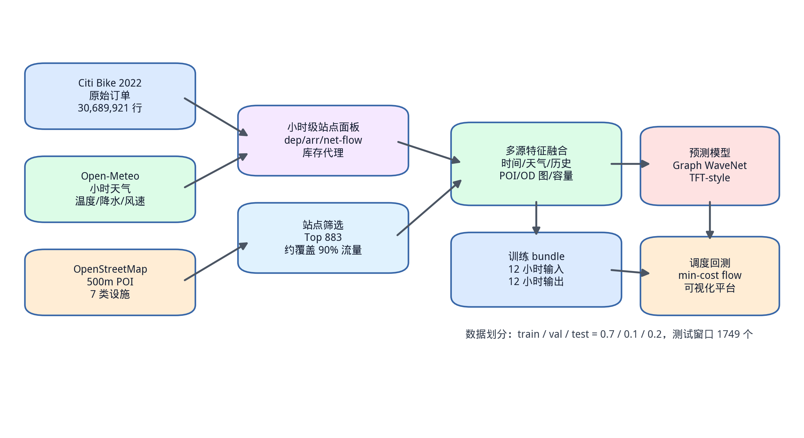

### 3.6 数据质量与可复现性控制

本文在数据构建过程中遵循时间顺序和信息可得性原则。训练集、验证集和测试集按照时间顺序划分，所有标准化参数仅由训练集估计，再应用到后续数据。历史滞后、滚动统计和 OD 关系图也只使用当前时刻之前或训练期内的信息，避免将未来需求泄漏到模型输入中。

为保证实验结果可复核，本文对主要数据口径和模型结果进行版本化保存，并统一预测指标和调度指标的计算方式。预测指标均在反归一化后的原始订单计数尺度上报告，调度指标均在相同测试窗口、相同库存安全带和相同搬运上限下计算。探索性实验不纳入正式结果比较，只作为模型设计过程中的参考。

本章完成了从原始订单到多源预测样本的构建说明。通过统一时间粒度、站点筛选、特征构造、OD 图泄漏控制和可复现性管理，本文为后续模型训练和调度回测提供了稳定的数据基础。

## 4 共享单车需求预测模型设计

### 4.1 任务定义

本文预测任务是多站点、多步长、双目标需求预测。给定过去 12 小时的多源特征，模型需要输出未来 12 小时每个站点的出发量和到达量。输入张量可以表示为：

$$
X \in R^{B \times T_{in} \times N \times F}
$$

其中 B 为批量大小，T_in=12，N=883，F 为特征维度。输出张量为：

$$
\hat{Y} \in R^{B \times T_{out} \times N \times 2}
$$

其中 T_out=12，最后一维两个通道分别为 出发量 和 到达量。对于 TFT-style 分位数模型，输出进一步扩展为：

$$
\hat{Y} \in R^{B \times T_{out} \times N \times 2 \times 3}
$$

三个分位数为 q10、q50 和 q90。

模型训练与评价需要区分模型空间和业务空间。部分模型在 log1p 空间训练，损失函数直接作用于变换后的目标，以提升训练稳定性；但最终论文指标必须回到原始订单计数尺度，因为 MAE、RMSE 和 MAPE 只有在原始尺度下才具有业务解释。本文所有正式预测表格中的 MAE 和 RMSE 均为反变换后的结果，表示每站每小时出发量或到达量的平均误差。

由于本文预测目标包含出发量和到达量两个通道，模型输出不仅要分别拟合二者，还要保证二者差值能够合理反映库存变化。若出发量和到达量的单独误差较低，但误差方向相互抵消或放大，净流量预测仍可能偏离真实库存变化。因此，本文在 Graph WaveNet（目标时间特征与净流量辅助损失）中显式加入净流量辅助损失，在调度章节中也以“到达量减出发量”作为预测驱动输入。

### 4.2 AGCRN 基线与关系图实验

本文首先适配 AGCRN 作为站点级预测基准模型。AGCRN 使用节点嵌入学习自适应图结构，并通过图卷积循环单元建模时间依赖[13]。在原始计数目标下，AGCRN 的平均 MAE 为 2.2096。

AGCRN 适合作为本文早期基准模型的原因在于它能够在没有人工邻接矩阵的情况下学习节点间关系。共享单车站点之间的连接关系不如道路传感器那样明确，如果直接使用地理距离或固定邻接矩阵，可能会引入错误先验。AGCRN 的自适应图通过节点嵌入计算节点相似度，再在图卷积循环结构中传播信息，为后续研究图结构先验提供了基础参照。

随后，本文尝试三类图结构增强。第一类是地理距离 kNN 图，即根据站点经纬度构造邻接矩阵。实验结果显示，强地理先验会明显劣化预测效果，弱地理先验仍略差于仅使用自适应图的基准模型。这说明在共享单车场景中，距离近不一定代表需求变化相关。

第二类是完整 OD 图。训练期 OD 图能够反映站点间真实骑行流向，但完整图非零边密度较高，包含大量低流量边。实验发现，若 OD 权重过强，模型效果下降；若作为极弱先验，则平均 MAE 从 2.2096 小幅下降到 2.1969。

第三类是 top-k OD 图。top-k20 图在 AGCRN 中取得 2.1951 的平均 MAE，略优于完整 OD 弱先验方案。该结果说明 OD 关系有一定价值，但收益幅度有限，继续提升需要从目标变换和模型结构入手。

这组实验对本文后续路线有重要影响。若显式空间图能够带来大幅提升，则后续重点应放在更复杂的关系图构造；但实验表明，图结构改进进入边际收益区间后，继续微调 k 值或融合权重很难产生明显突破。因此，本文将研究重心转向目标变换和时序结构升级，并最终选择 Graph WaveNet 作为主图网络结构。

### 4.3 目标变换与损失函数

共享单车小时需求具有低值多、零值多和长尾高峰特点，直接在原始计数空间使用 MAE 训练可能使模型难以同时兼顾低需求站点和高峰站点。本文尝试 log1p 目标变换：

$$
y'=\log(1+y)
$$

预测后通过 expm1 反变换回原始计数空间评价指标。AGCRN top-k20 OD 图在 log1p 目标下平均 MAE 降至 2.1073，相比原始计数目标的 2.1951 有明显改善。季节残差、Huber 损失和非零加权 MAE 等方案未进一步提升主指标，因此后续 Graph WaveNet 和 TFT-style 模型均采用 log1p 作为主要目标变换。

log1p 变换的作用可以从误差分布角度理解。原始计数目标中，少数高峰站点和高峰时段会产生较大绝对误差，容易主导模型更新；大量低需求站点又需要模型保持对零值和小值的敏感性。log1p 将大值压缩到较平滑范围，同时保留零值可定义性，使模型更容易同时学习低需求和高需求模式。反变换后虽然仍可能低估极端峰值，但整体 MAE 和 RMSE 都得到改善。

季节残差目标的思路是预测相对于上周同小时的残差，试图利用共享单车需求的周周期。但实验中该方法 MAE 与 log1p 接近而 RMSE 更差，说明它对常规周期有帮助，但在突发变化或高峰幅度上不够稳定。Huber 和非零加权 MAE 在当前设置下显著变差，可能是因为它们改变了低值样本和高值样本之间的平衡，使模型过度关注非零需求或中等误差。

### 4.4 Graph WaveNet（目标时间特征与净流量辅助损失） 模型

Graph WaveNet 使用扩张因果卷积捕获多尺度时间依赖，并结合图卷积建模站点间关系[14]。相比 AGCRN 的循环编码器，扩张卷积可以并行计算，感受野随层数指数增长，更适合多步交通预测。本文 Graph WaveNet 基础模型使用 2 个模块，每个模块包含 3 层扩张卷积，扩张率为 1、2、4，并使用 top-k20 OD 弱先验图和自适应图共同构成图卷积支持。

在早期可视化分析中，Graph WaveNet 基础模型对部分样例的全网净流量峰谷存在相位偏移。由于调度算法直接使用净流量预测，本文进一步设计 Graph WaveNet（目标时间特征与净流量辅助损失）版本。该版本加入未来目标时间特征，包括目标小时、星期、月份和周末标志的编码，并将原有固定步长输出改为目标时间条件化输出，使每个未来步长都能感知自己的目标时间身份。

此外，本文加入净流量辅助损失：

$$
Loss = MAE_{dep,arr}^{model} + \lambda MAE_{net}^{count}
$$

其中 $\lambda=0.10$，$MAE_{dep,arr}^{model}$ 在 log1p 模型空间计算，$MAE_{net}^{count}$ 在反变换后的计数空间对 $arr-dep$ 计算，并使用训练专用 count cap 避免训练初期数值不稳定。实验结果表明，该模型平均 MAE 为 1.6238，净流量 MAE 为 1.5658，是本文最强图网络版本。

未来目标时间特征的加入解决了一个常见的多步预测问题：模型如果只看到过去 12 小时输入，并通过固定输出层给出未来 12 个步长，那么不同步长的时间身份主要由输出位置隐式表达。对于共享单车这种强日周期任务，未来第 1 小时和第 12 小时可能对应完全不同的通勤阶段。目标时间条件化输出将目标小时、星期和月份显式注入每个预测步长，使模型能够区分“预测未来第几步”和“预测未来哪个时间点”。

净流量辅助损失则体现了预测模型与调度任务的耦合。出发量和到达量的单独误差并不能完全代表库存变化误差，尤其在两个通道同时偏高或偏低时，净流量误差可能与点预测误差表现不同。加入辅助损失后，模型不仅学习单独的租还需求，也被约束去拟合到达量与出发量差值的方向和幅度，从而更适合作为调度输入。

图4-1展示了预测模型总体结构。

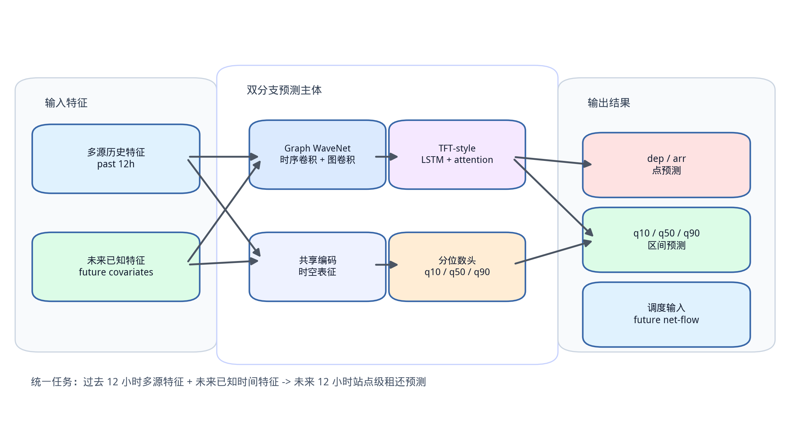

图4-2展示了 Graph WaveNet（目标时间特征与净流量辅助损失）模型结构。

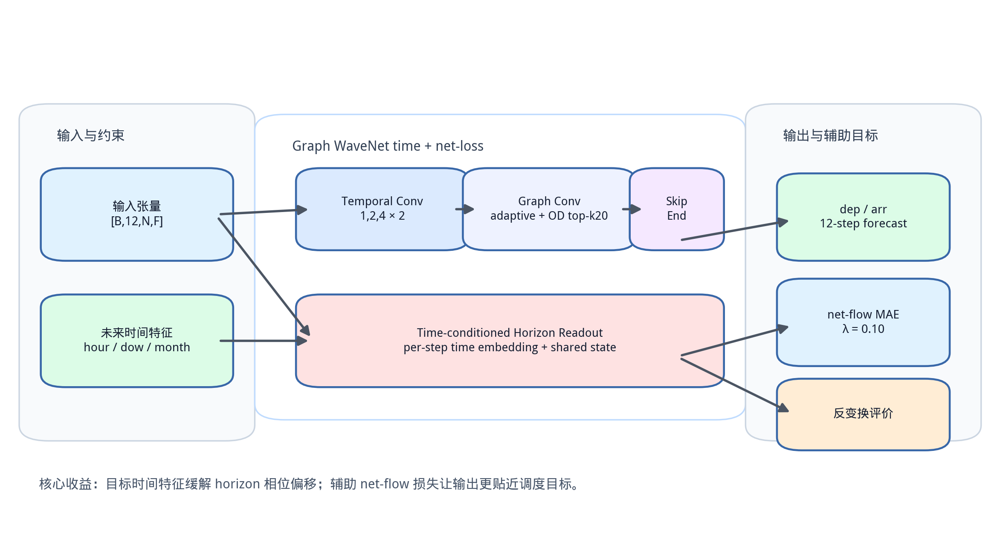

### 4.5 TFT-style 分位数预测模块

为满足多源特征融合、未来已知输入、分位数预测和可解释性分析要求，本文实现 TFT-style 分位数模型模块[9]。该模块不是官方 PyTorch Forecasting TFT 的完全复现，而是在多站点密集张量数据结构下实现的轻量化模块。

模型结构包括五个部分。第一，输入特征经过共享投影和门控特征变换，得到站点小时级隐藏表示。第二，LSTM 时序编码器编码过去 12 小时历史序列。第三，未来目标时间特征经过解码查询投影，为每个预测步长构造查询向量。第四，多头时间注意力从未来步长查询过去隐藏状态，得到面向未来步长的上下文表示。第五，站点嵌入作为静态上下文，与时间上下文融合后输入单调分位数输出层，输出出发量和到达量的 q10、q50、q90。

为了保证分位数单调性，模型的分位数输出层以基础预测加非负增量的方式构造 q10、q50 和 q90，减少 q10 大于 q50 或 q50 大于 q90 的交叉问题。训练目标为 log1p 空间中的 Pinball Loss，测试时使用 q50 作为点预测，q10-q90 作为 80% 预测区间。

TFT-style 模块与 Graph WaveNet 的定位不同。Graph WaveNet 更强调图结构和多尺度时序卷积，是本文预测-调度闭环中的强点预测模型；TFT-style 模块更强调多源特征融合、未来已知输入、区间预测和解释性分析。二者不是简单替代关系，而是在论文中承担不同作用：Graph WaveNet 用于验证图时序结构对共享单车预测的效果，TFT-style 用于满足风险感知预测和可解释性需求。

净流量分位数根据出发和到达分位数组合得到：

$$
net\_flow_{q10}=arr_{q10}-dep_{q90}
$$

$$
net\_flow_{q50}=arr_{q50}-dep_{q50}
$$

$$
net\_flow_{q90}=arr_{q90}-dep_{q10}
$$

其中 q10 表示更保守的净流量估计，q90 表示更激进的净流量估计。该设计使调度模块可以在中位、保守和激进三种风险模式下使用分位数预测结果。

图4-3展示了 TFT-style 分位数预测模块结构。

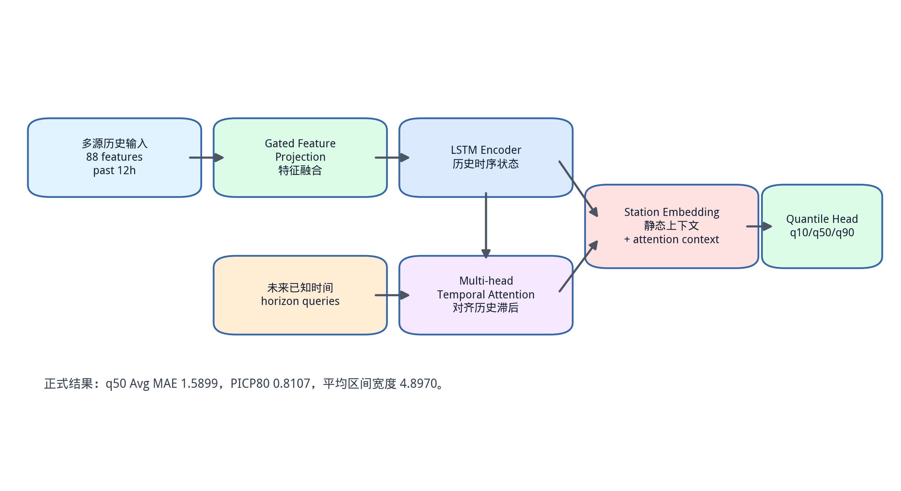

### 4.6 可解释性分析

TFT-style 模块提供两类解释性材料。第一类是注意力滞后分析，统计测试样本中未来预测步长对过去 12 小时隐藏状态的平均注意力，形成预测步长与历史滞后的注意力矩阵。第二类是特征敏感度分析，使用梯度加权输入方法在归一化输入空间估计特征组敏感度。该方法不是官方 TFT 变量选择网络输出，但可以作为后验敏感度分析，辅助说明模型关注的历史模式和外部特征。

正式实验中，注意力平均最高的相对小时为 0，即模型最关注最近决策时刻；特征组敏感度中，历史特征、时间特征、POI、骑行类型和站点静态属性排名靠前，说明历史滚动统计、时间周期、站点周边环境和站点静态属性都参与了预测。

解释性结果需要谨慎使用。注意力权重可以反映模型在时间维度上更关注哪些历史滞后，但不能直接等同于因果影响；梯度加权输入敏感度可以反映输入扰动对输出的局部影响，但受模型非线性、归一化尺度和样本选择影响。因此，本文将这些结果作为辅助解释材料，而不是作为严格因果结论。它们的主要价值在于验证模型是否符合基本业务直觉，例如关注近期需求和历史周期模式。

### 4.7 本章小结

本章围绕共享单车需求预测任务，介绍了从 AGCRN 基准模型到 Graph WaveNet（目标时间特征与净流量辅助损失），再到 TFT-style 分位数模块的模型设计过程。实验迭代表明，单纯增加固定空间先验收益有限，log1p 目标变换和扩张时序卷积结构带来了更明显提升；未来目标时间特征和净流量辅助损失进一步强化了模型对调度相关目标的刻画。TFT-style 模块则补充了分位数区间和可解释性分析，为后续风险调度和系统展示提供输入。

## 5 预测驱动的智能再平衡调度算法

### 5.1 问题定义

共享单车调度的目标是在合理成本下减少缺车和满站风险。本文使用离线历史回测方式，将每个站点库存表示为代理库存，并设定代理容量。对于站点 i，其安全库存带定义为：

$$
lower_i=0.2 \times capacity_i
$$

$$
upper_i=0.8 \times capacity_i
$$

如果未来库存低于 lower，则认为站点存在缺车风险；如果未来库存高于 upper，则认为站点存在满站风险。调度算法需要根据未来净流量预测，在每个决策时刻生成从供给站点到需求站点的车辆搬运方案。

安全库存带的设置体现了服务水平和调度成本之间的折中。若安全下界设置过高，系统会倾向于为大量站点补车，导致搬运车辆数和里程增加；若安全上界设置过低，系统又会频繁从站点移车，可能造成不必要的调度动作。本文采用 20% 至 80% 容量作为统一安全带，是一种简单、可解释且便于横向比较的设定。由于容量本身为代理估计值，本文更关注不同算法在相同口径下的相对改善，而不是将边界小时直接解释为真实运营 KPI。

本文调度问题的输入包括三部分：当前库存状态、未来净流量预测和站点间距离矩阵。输出包括站点级任务表和站点间调度方案。任务表记录每个站点在当前决策中的角色、目标库存和请求变化量；调度方案记录每条搬运边的起点、终点、车辆数和距离。库存模拟器再将调度方案与未来真实净流量结合，回放调度后库存变化过程，用于计算边界指标。

### 5.2 滚动时域库存模拟

本文采用滚动时域决策。每个决策时刻读取当前库存，并根据未来 12 小时净流量预测递推库存变化过程：

$$
\hat{I}_{t+h,i}=I_{t,i}+\sum_{k=1}^{h}\hat{net\_flow}_{t+k,i}
$$

其中 h=1,...,12。根据预测库存变化过程，算法计算每个站点需要增加或减少的车辆数。若未来库存低于下界，则产生正向补车需求；若高于上界，则产生负向移车需求。该需求并不是最终调度结果，而是供给站点和需求站点匹配前的库存规划结果。

为避免不现实的大规模瞬时调度，本文设置每个决策时刻最多搬运 200 辆车。该约束比无上限 理想预测 更接近现实运营能力，也使不同算法结果可比。

滚动时域决策的优势在于可以不断修正预测误差。虽然每次决策会观察未来 12 小时，但系统只在当前决策时刻执行一批搬运动作；下一小时到来后，库存状态会根据真实历史流量更新，系统再重新读取预测并生成新的调度方案。这样既利用了多步预测信息，又避免一次性承诺过长时间范围内的调度计划。

在离线回测中，本文使用真实历史流量更新库存，而不是使用预测流量更新库存。原因是回测希望评估“如果当时按照预测结果调度，真实世界随后会发生什么”。因此，预测只用于生成决策，评价阶段的库存演化必须使用真实出发量、到达量或净流量。这一点保证了预测驱动调度结果能够反映预测误差对实际库存边界的影响。

### 5.3 贪心匹配基线

贪心算法将站点分为供给站点和需求站点后，按距离优先匹配车辆。对于每个需求站点，算法优先选择距离最近且仍有供给的供给站点，直到需求站点需求满足或供给站点供给耗尽。该方法简单、可解释、运行速度快，但只做局部最优决策，无法保证全局搬运里程最小。

贪心算法适合作为调度基准，用于观察库存规划逻辑是否有效。本文的理想预测贪心匹配方案在每小时最多搬运 200 辆车的约束下，将测试集无调度情形的安全库存带违规小时从 1,044,008 降至 110,783，说明调度链路能够显著改善库存风险。

贪心算法的局限在于局部选择可能影响全局成本。例如，一个距离最近的供给站点若被先分配给某个需求站点，可能导致另一个需求更大的需求站点只能匹配更远的供给站点，从而增加总里程。对于小规模站点或供需分布简单的场景，贪心策略通常足够有效；但在本文 883 个站点、1749 个决策窗口的回测中，全局匹配算法更能体现调度成本优化价值。

### 5.4 最小费用流匹配

为了降低全局搬运距离，本文将供给站点和需求站点匹配建模为最小费用流。构造有向网络：

$$
source \rightarrow 供给站点 \rightarrow 需求站点 \rightarrow sink
$$

每个供给站点的供给量为需要移出的车辆数，每个需求站点的需求量为需要补入的车辆数，供给站点到需求站点的边费用为两站点间球面距离。算法目标是在供需和每小时搬运上限约束下最小化总费用：

$$
\min \sum_{i \in D}\sum_{j \in R} c_{ij}x_{ij}
$$

其中 $x_{ij}$ 表示从供给站点 i 搬到需求站点 j 的车辆数，$c_{ij}$ 表示距离成本。本文使用带残量势能的连续最短路方法求解最小费用流。相比贪心匹配，最小费用流能从全局角度分配供给站点和需求站点，在相同搬运车辆数下通常具有更低搬运里程。

最小费用流版本只替换供给站点和需求站点匹配器，不改变前面的库存规划逻辑。这样设计有利于公平比较：贪心匹配和最小费用流面对同一批供给站点、需求站点和搬运上限，差异只来自匹配策略。实验中，在每小时最多搬运 200 辆车且总搬运车辆数相同的情况下，理想预测最小费用流方案比理想预测贪心匹配方案减少约 880.6 的搬运里程，同时略微降低低库存小时，说明全局优化确实改善了匹配质量。

本文没有使用完整 OR-Tools CVRP 求解器作为主算法[29]，主要出于两点考虑。第一，本文的重点是预测结果如何转化为站点供需任务，而不是货车路径细节；第二，CVRP 需要设定车辆数、车辆容量、出发仓库、服务时间等额外参数，这些在公开历史订单数据中并不具备可靠来源。最小费用流保留了距离成本优化的核心，同时避免引入过多难以验证的运营假设。

### 5.5 风险分位数调度

TFT-style 模块输出 q10、q50 和 q90 净流量预测，因此调度算法支持三种风险模式。中位模式使用 q50，即中位预测；保守模式使用 q10，更偏向低净流量估计；激进模式使用 q90，更偏向高净流量估计。三种模式可以模拟不同风险偏好的调度策略。

实验结果显示，q50 是三种模式中最均衡的。q10 和 q90 会明显偏置库存决策，导致安全库存带违规增加。这说明分位数预测虽然提供了不确定性信息，但直接使用单侧分位数进行调度并不一定更优，后续更合理的方向是将分位数区间转化为显式风险目标或鲁棒优化约束。

从业务含义看，q10 和 q90 并不是“更安全”的简单替代。净流量等于到达量减出发量，q10 更偏向低净流量，可能使算法更担心车辆流出；q90 更偏向高净流量，可能使算法更担心车辆流入。若直接使用单侧分位数，系统会系统性高估某一类风险，从而在另一侧产生新的库存问题。本文实验中 q10 和 q90 均显著劣化，说明风险调度需要同时考虑上下界，而不是只选择一个分位数作为点预测。

图5-1展示了预测驱动调度流程。

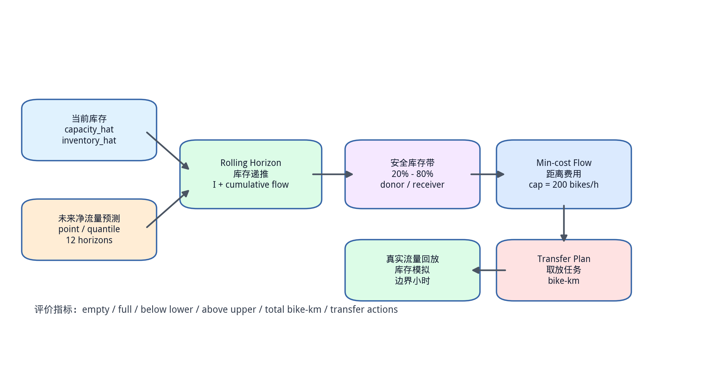

### 5.6 调度评价指标

本文从服务水平和调度成本两个角度评价调度结果。服务水平指标包括空站小时、满站小时、低于安全下界小时和高于安全上界小时。空站小时表示库存等于或低于空站阈值的站点小时，满站小时表示库存达到容量上限附近的站点小时；低于安全下界和高于安全上界则使用安全库存带判断更宽泛的风险状态。二者相比，空站和满站更接近用户直接感知，安全库存带指标更适合衡量提前调度是否使库存保持在健康范围内。

调度成本指标包括总搬运车辆数、调度动作数和总搬运里程。搬运车辆数表示总搬运车辆数，调度动作数表示站点间搬运边数量，搬运里程表示车辆数乘以搬运距离的总和。一个算法可能通过增加搬运车辆降低缺车风险，也可能通过更短距离匹配降低搬运里程。因此，本文不使用单一指标判断算法优劣，而是结合库存边界改善和搬运成本进行分析。

### 5.7 本章小结

本章提出了预测驱动的共享单车再平衡调度框架。算法首先基于未来净流量预测进行滚动库存推演，再根据安全库存带识别供给站点和需求站点，最后使用贪心匹配或最小费用流生成站点间搬运任务。与完整车辆路径规划相比，本文方案更聚焦于预测结果到站点供需任务的转化，适合在离线历史数据上进行可复现评估。实验章节将进一步比较理想预测、Graph WaveNet 预测和 TFT-style 分位数预测在该调度框架下的表现。

## 6 系统设计与实现

### 6.1 系统总体架构

本文实现的系统是一个离线历史回测平台，用于展示共享单车预测与调度链路。系统不接入实时车辆、实时订单或在线天气 API，而是固定使用 NYC Citi Bike 2022 年历史数据、离线预测结果和调度回测结果。这样设计的目的是保证实验可复现，并避免将论文重点转移到生产级在线数据接入。

系统采用前后端分离架构。后端使用 FastAPI，负责组织站点小时面板、模型输出和调度结果，并根据用户选择的时间、模型、算法和搬运上限返回结构化数据[30]。前端使用 React 和 TypeScript 构建[31]，地图展示使用 MapLibre GL JS[32]，曲线图使用 ECharts[33]。用户可以在测试集时间范围内选择任意决策时刻，查看站点状态、预测曲线、调度路线和库存回放结果。

平台的核心交互是“选择一个历史决策时刻，观察模型如何预测，调度算法如何决策，真实历史如何验证”。用户选择时间后，后端首先读取该时刻的当前库存和未来真实流量；随后根据模型选择 TFT-style 分位数预测、Graph WaveNet 点预测或理想预测；再根据算法选择贪心匹配或最小费用流；最后将站点角色、调度路线、未来库存变化过程和指标汇总返回前端。该流程保证前端展示的每一条路线和每一个指标都可以追溯到后端计算。

图6-1展示了系统架构。

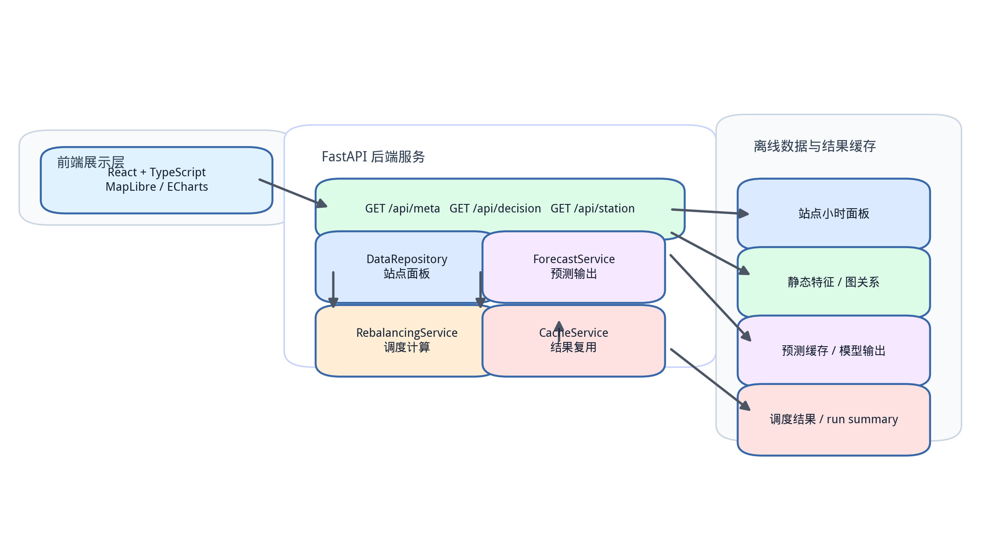

### 6.2 后端服务

后端主要承担数据读取、预测结果组织、调度计算和指标汇总四类功能。数据读取模块负责获取站点小时面板、站点静态属性、历史库存估计和未来真实流量，为预测和调度提供统一的数据入口。预测模块根据用户选择的模型输出未来 12 小时出发量、到达量或净流量预测，其中 TFT-style 模型还提供 q10、q50 和 q90 分位数结果，用于展示预测区间。

调度模块根据当前库存、未来净流量预测和站点间距离生成供给站点、需求站点和调度方案，并计算搬运车辆数、调度动作数、车辆搬运里程以及库存边界变化等指标。为提高交互展示的响应速度，系统会复用已经计算过的历史决策结果。由于本文系统使用固定历史数据进行离线回测，该机制不会影响实验一致性。

后端接口围绕论文展示场景设计。系统能够返回可选时间范围、模型列表、算法列表、当前决策下的地图图层、预测曲线、调度路线、指标卡和单站库存变化过程。前端不需要理解底层数据结构或模型实现细节，只负责将后端返回的结构化结果可视化呈现。

为了保证响应速度和结果稳定性，平台默认读取已经生成的预测结果，而不是每次访问时重新进行模型推理。这种方式与论文实验指标保持一致，也便于结果复核。

### 6.3 前端展示

前端界面围绕实验分析和结果展示场景设计。主要功能包括：

第一，历史决策时间选择。用户可以选择测试集内的决策时刻，也可以使用上一小时、下一小时和测试集起点快捷按钮。

第二，模型和算法切换。用户可以选择 TFT-style 分位数模型 q50、Graph WaveNet（目标时间特征与净流量辅助损失）、Graph WaveNet 基础模型或理想预测作为预测源，并选择贪心匹配或最小费用流调度算法。

第三，站点地图展示。地图上显示每个站点的位置、库存风险状态、供给站点或需求站点角色和调度路线。用户可以过滤站点角色，也可以设置调度路线显示阈值。

第四，预测和库存曲线。聚合净流量图展示未来 12 小时真实值、预测值和可选 q10/q90 区间；站点详情图展示单站无调度库存、预测调度库存、真实回放库存和 TFT 预测库存区间。

第五，结果导出。前端支持导出当前决策结果，便于说明某个时间点的调度任务。

图6-2展示了平台真实界面截图。

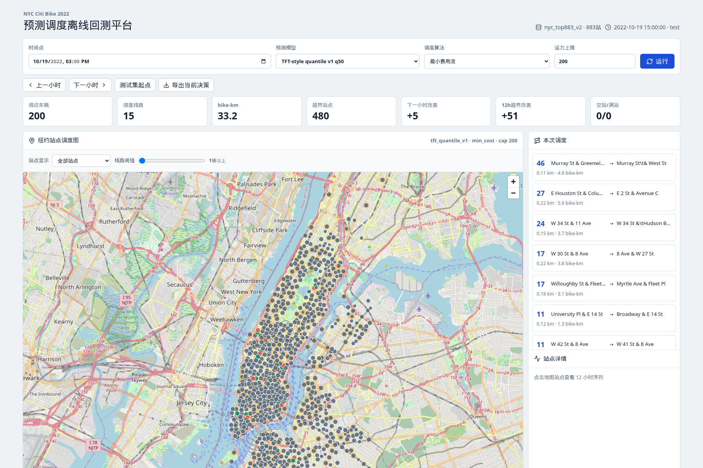

### 6.4 系统边界

本文系统的边界需要明确。第一，系统使用历史数据回测，不代表实时生产系统。第二，库存和容量是由历史流量构造的代理值，不是真实运营库存观测。第三，调度算法生成的是站点间搬运任务，不包含多辆货车的完整路径排序、司机排班和道路时间窗。第四，POI 数据来自当前 OSM 快照，作为站点周边建成环境代理变量，而不是 2022 年精确历史 POI 状态。

这些边界不会影响本文对预测模型、调度算法和系统闭环的研究价值，但在论文表述中需要清晰说明，避免夸大系统的生产可用性。

### 6.5 系统实现特点

本文系统实现有三个特点。第一，实验分析和平台展示使用同一套数据口径和预测结果，避免论文表格与演示系统之间出现指标不一致。第二，系统保留了模型和调度算法的可切换性，用户可以在同一历史决策时刻下比较不同预测源和匹配策略的调度差异。第三，系统强调站点级解释，除全局指标外，还可以查看单个站点的库存变化过程、预测区间和调度后边界状态。

这种设计使平台不仅能够展示研究结果，也能够辅助分析模型误差如何影响调度决策。共享单车调度问题常常表现为局部站点风险，单站详情能够帮助解释某个站点为何被识别为供给站点或需求站点，以及调度后是否仍存在缺车或满站风险。

### 6.6 本章小结

本章介绍了离线可视化平台的总体架构、后端服务、前端交互和系统边界。平台将预测模型、调度算法和历史回测结果整合到同一工作台中，用于模型解释、结果展示和实验分析。由于系统基于固定历史数据运行，本文能够保证展示结果与论文实验结果一致。

## 7 实验结果与分析

### 7.1 实验设置

本文实验在统一数据口径下进行。主预测任务为纽约 883 个站点的小时级需求预测，输入过去 12 小时，预测未来 12 小时出发量和到达量。指标在反归一化、反 log1p 后的原始订单计数尺度上计算。主指标为出发量和到达量的平均 MAE，同时报告 RMSE 和 MAPE。TFT-style 分位数模型额外报告 Pinball Loss、PICP80 和 q10-q90 平均区间宽度。

调度实验使用测试集 1749 个决策窗口。主调度约束为每小时最多搬运 200 辆车，库存安全带为容量的 20% 至 80%。调度指标包括空站小时、满站小时、低于安全下界小时、高于安全上界小时、安全库存带违规小时、总搬运车辆数、调度动作数和总搬运里程。

### 7.2 预测模型结果

表7-1给出主要预测实验结果。

| 模型 | 数据口径 | 主要方法 | 最佳轮次 | 出发量 MAE | 到达量 MAE | 平均 MAE | 平均 RMSE | 平均 MAPE | 结论 |
|---|---|---|---:|---:|---:|---:|---:|---:|---|
| AGCRN 基准模型 | 基础特征口径 | 自适应图卷积，原始目标 | 7 | 2.2115 | 2.2077 | 2.2096 | 3.6676 | 0.9703 | 作为早期基准 |
| AGCRN 改进模型 | 基础特征口径 | OD 关系图与目标变换 | 7 | 2.1133 | 2.1014 | 2.1073 | 3.5620 | 0.9330 | 目标变换明显改善 |
| Graph WaveNet 基础模型 | 基础特征口径 | 扩张时序卷积与图卷积 | 10 | 1.7438 | 1.7894 | 1.7666 | 3.0577 | 0.7610 | 结构升级带来主要收益 |
| Graph WaveNet 改进模型 | 基础特征口径 | 目标时间特征与净流量辅助损失 | 12 | 1.6197 | 1.6278 | 1.6238 | 2.9280 | 0.6482 | 图网络模型中表现最好 |
| Graph WaveNet + POI | POI 融合口径 | 加入站点周边 POI 特征 | 11 | 1.7367 | 1.7100 | 1.7233 | 2.9457 | 0.7592 | POI 未改善点预测 |
| TFT-style 分位数模型 | POI 融合口径 | q10/q50/q90 与 Pinball Loss | 7 | 1.5939 | 1.5858 | 1.5899 | 2.8705 | 0.6688 | 点预测指标最好，PICP80 为 0.8107 |

从表7-1可以看出，目标变换、扩张时序卷积结构和目标时间特征均能提升预测效果。AGCRN 改进模型相较基准模型降低了平均 MAE，说明 OD 关系图和目标变换具有一定作用。Graph WaveNet 基础模型进一步降低误差，表明扩张时序卷积更适合多步站点需求预测。加入目标时间特征和净流量辅助损失后，Graph WaveNet 改进模型的平均 MAE 降至 1.6238，并取得 1.5658 的净流量 MAE。

TFT-style 分位数模型在 q50 点预测上取得最低平均 MAE，同时能够输出 q10-q90 预测区间。该结果说明，在多源特征和分位数损失的共同作用下，模型不仅能够给出较准确的中位预测，也能够提供一定的不确定性表达。图7-1展示了主要模型的平均 MAE 对比。

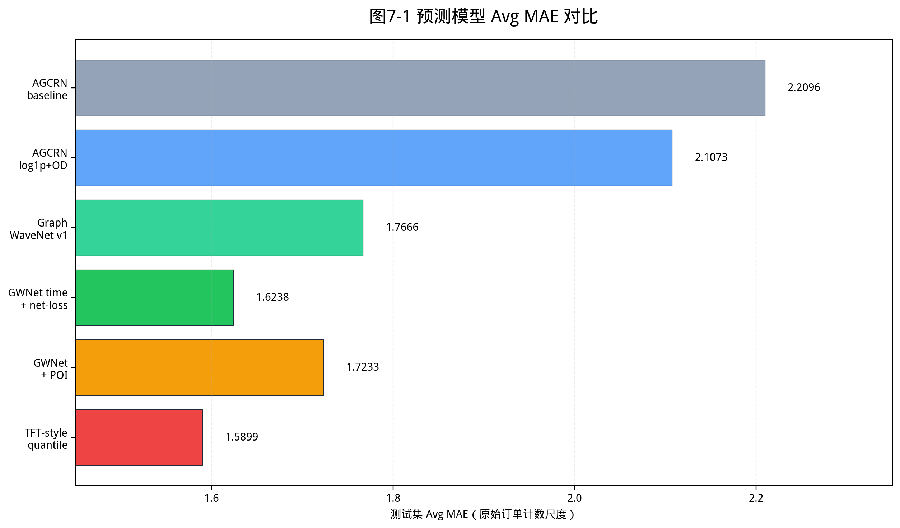

### 7.3 外部时空模型对比

为了增强对比可信度，本文将 CCRNN、ESG、ReMo-style 和 GMRL 等外部时空模型思想适配到统一站点预测任务中。结果见表7-2。

| 对比模型 | 数据口径 | 出发量 MAE | 到达量 MAE | 平均 MAE | 平均 RMSE | 平均 MAPE | 备注 |
|---|---|---:|---:|---:|---:|---:|---|
| CCRNN | 基础特征口径 | 2.9035 | 2.8866 | 2.8951 | 4.3847 | 1.0658 | 保留动态图耦合思想 |
| ESG | 基础特征口径 | 1.8793 | 1.8726 | 1.8760 | 3.2099 | 0.8297 | 外部模型中表现较好 |
| ReMo-style | 基础特征口径 | 2.2569 | 2.2795 | 2.2682 | 3.7975 | 0.9590 | 基于细粒度关系建模思想 |
| GMRL | 基础特征口径 | 1.8905 | 1.9093 | 1.8999 | 3.3748 | 0.7415 | 使用出发量和到达量二源张量 |

外部模型中 ESG 和 GMRL 表现较好，但平均 MAE 仍高于本文主线模型。CCRNN 在本任务上效果较弱，说明原模型结构与共享单车站点级数据口径并不完全匹配。ReMo-style 结果体现了细粒度关系建模思想的可行性，但在当前数据规模和特征设置下尚未超过 Graph WaveNet 和 TFT-style 模型。

### 7.4 消融实验分析

本文的消融实验包含图结构、目标变换、POI 特征和调度预测源四类。

在图结构方面，地理距离图没有提升模型效果。强地理融合使 AGCRN 平均 MAE 变为 2.4675，弱融合也为 2.2458，均差于仅使用自适应图的基准模型 2.2096。该结果说明共享单车站点需求关联不等价于地理邻近。OD 图作为弱先验可带来小幅改善，top-k20 OD 将 AGCRN 平均 MAE 降至 2.1951，但提升有限。

在目标变换方面，log1p 是 AGCRN 阶段最有效的优化。季节残差的 MAE 接近 log1p，但 RMSE 较差；Huber 和非零加权 MAE 明显劣化。说明当前任务中对长尾需求进行 log 压缩比简单加权损失更稳健。

在 POI 特征方面，POI 没有提升 Graph WaveNet 的出发量和到达量点预测。Graph WaveNet（目标时间特征与净流量辅助损失）从无 POI 的 1.6238 变为 POI 版本的 1.7233。但 POI 对净流量 MAE 有轻微改善，从 1.5658 降至 1.5569。这说明在已经包含历史流量、天气、时间和 OD 关系后，静态 POI 对小时级点预测的边际收益有限，但对站点功能差异仍可能有辅助价值。

在预测源方面，TFT-style q50 的点预测 MAE 最低，但调度指标并非最好。这一现象将在调度实验中进一步分析。

### 7.5 分位数预测与可解释性

表7-3给出 TFT-style 分位数模型的分位数预测结果。

| 指标 | dep | arr | average |
|---|---:|---:|---:|
| q50 MAE | 1.5939 | 1.5858 | 1.5899 |
| q50 RMSE | 2.8481 | 2.8927 | 2.8705 |
| q50 MAPE | 0.6761 | 0.6614 | 0.6688 |
| PICP80 | 0.8152 | 0.8062 | 0.8107 |
| q10-q90 区间宽度 | 5.0468 | 4.7473 | 4.8970 |

PICP80 为 0.8107，说明 q10-q90 区间对真实值的覆盖率略高于 80%，整体校准较合理。平均区间宽度为 4.8970，说明模型在保持覆盖率的同时没有生成过宽区间。后续论文终稿可以选择若干典型站点和时段绘制 q10-q90 预测区间样例。

图7-2展示了 TFT q10-q90 预测区间样例。

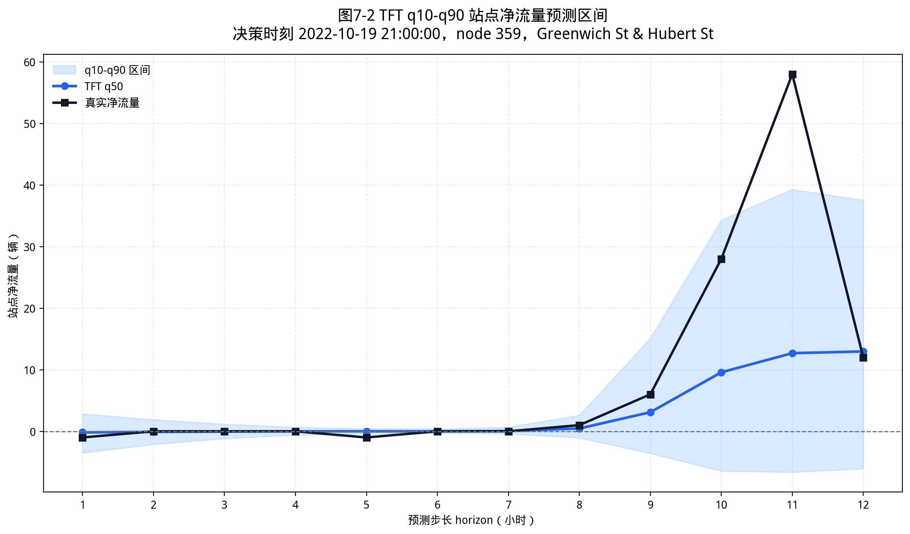

可解释性方面，注意力滞后分析显示模型最关注最近决策时刻，符合短期需求具有惯性的业务直觉。特征组敏感度结果见表7-4。

| 特征组 | 敏感度 |
|---|---:|
| 历史特征 | 4.8161e-05 |
| 时间特征 | 2.1870e-05 |
| poi | 2.0857e-05 |
| 骑行类型 | 1.6073e-05 |
| 站点静态属性 | 1.1974e-05 |
| 天气特征 | 1.1208e-05 |
| 库存相关特征 | 6.9603e-06 |
| 节假日特征 | 2.5978e-06 |

历史模式特征排名最高，说明过去滚动统计和周期滞后是共享单车需求预测的主要信息来源。时间和 POI 特征也有较高敏感度，说明模型利用了未来已知时间信息和站点周边环境差异。天气和节假日特征排名相对靠后，可能是因为 2022 年测试集中大部分小时需求仍由日常通勤周期和历史惯性主导。

图7-3展示了注意力滞后热力图。

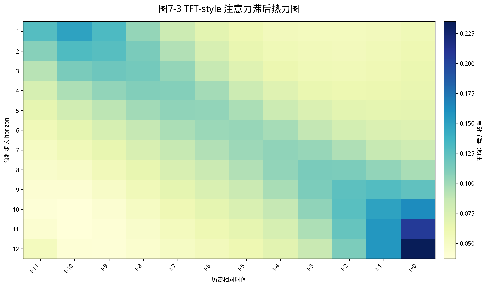

### 7.6 调度实验结果

表7-5给出主要调度回测结果。

| 调度情形 | 预测口径 | 匹配算法 | 搬运车辆 | 动作数 | 车辆搬运里程 | 空站小时 | 满站小时 | 低于安全下界 | 高于安全上界 | 安全库存带违规小时 |
|---|---|---|---:|---:|---:|---:|---:|---:|---:|---:|
| 无调度 | 无 | 无 | 0 | 0 | 0.0 | 1,569 | 6,137 | 412,308 | 631,700 | 1,044,008 |
| 理想预测 + 贪心匹配 | 真实未来净流量 | 贪心匹配 | 31,441 | 9,399 | 97,888.7 | 172 | 20 | 97,455 | 13,328 | 110,783 |
| 理想预测 + 最小费用流 | 真实未来净流量 | 最小费用流 | 31,441 | 9,442 | 97,008.1 | 167 | 20 | 96,889 | 13,331 | 110,220 |
| Graph WaveNet 基础模型 | 点预测 | 最小费用流 | 34,164 | 10,265 | 107,512.4 | 70 | 20 | 93,842 | 16,378 | 110,220 |
| Graph WaveNet 改进模型 | 点预测 | 最小费用流 | 33,620 | 11,239 | 106,482.2 | 165 | 20 | 99,860 | 16,956 | 116,816 |
| TFT-style 中位数预测 | q50 | 最小费用流 | 32,570 | 10,029 | 97,520.1 | 183 | 20 | 106,077 | 18,424 | 124,501 |
| TFT-style 下分位数预测 | q10 | 最小费用流 | 68,226 | 24,437 | 60,604.0 | 574 | 3,034 | 219,667 | 75,693 | 295,360 |
| TFT-style 上分位数预测 | q90 | 最小费用流 | 85,827 | 27,522 | 93,674.3 | 3,126 | 2,494 | 65,415 | 349,587 | 415,002 |

无调度情形的安全库存带违规小时为 1,044,008，说明测试集中大量站点小时处于不健康库存状态。理想预测下的最小费用流调度将该指标降至 110,220，证明在未来净流量可准确获知时，库存规划和调度匹配能够显著缓解缺车和满站风险。

预测驱动调度同样能够显著改善库存边界。Graph WaveNet 基础模型在安全库存带违规小时上接近理想预测结果，但需要更高车辆搬运里程。Graph WaveNet 改进模型虽然预测 MAE 更低，但调度指标略差，说明优化平均预测误差不一定等价于优化库存边界。TFT-style 中位数预测的点预测 MAE 最低，但调度效果不如 Graph WaveNet 基础模型，这进一步表明调度指标受到误差方向、站点容量和库存安全带位置的共同影响。

TFT-style q10 和 q90 风险口径产生明显偏置。q10 口径更关注低净流量风险，q90 口径更关注高净流量风险，二者都会放大某一侧库存风险，从而导致整体安全库存带违规增加。该结果说明，分位数预测不能简单通过替换点预测来获得稳健调度效果，更合理的做法是将预测区间转化为显式风险约束或鲁棒优化目标。

图7-4展示了调度结果安全库存带对比。

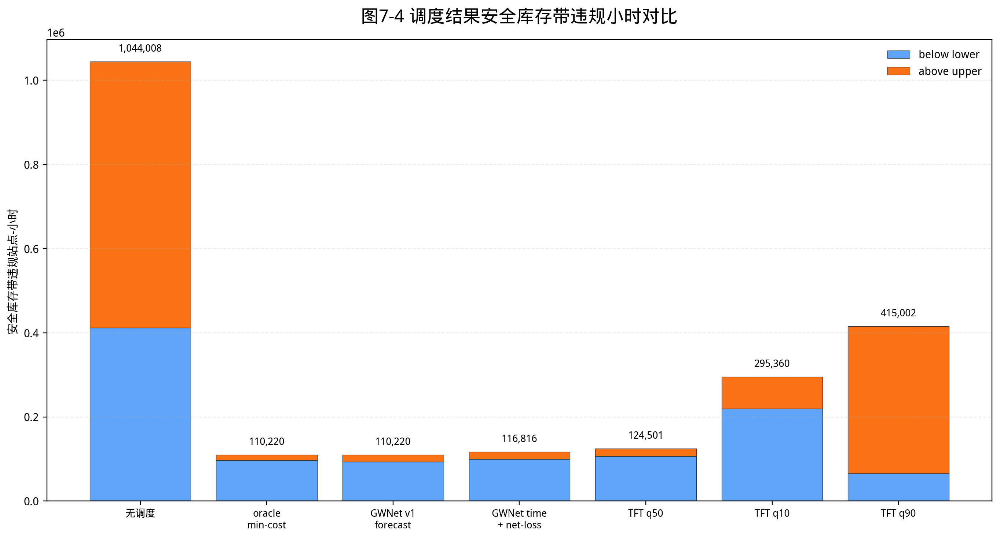

### 7.7 综合讨论

本文实验得到三个重要认识。

第一，多源特征并非越多越好。POI 特征对于 TFT-style 模块有助于形成完整的多源输入和可解释性分析，但在 Graph WaveNet 出发量和到达量点预测中没有带来提升。原因可能是历史流量和时间特征已经吸收了大部分站点功能差异，静态 POI 对小时级短期预测的边际作用有限。

第二，图结构先验需要弱化使用。地理距离图在共享单车任务中表现较差，OD 图只有作为弱先验时才有小幅收益。Graph WaveNet 训练后的关系权重仍高度偏向自适应图，说明模型更依赖从数据中学习的隐含关系。

第三，预测最优不等于调度最优。TFT-style q50 在 MAE 上最好，但调度结果不如 Graph WaveNet 基础模型驱动的最小费用流调度。调度指标受库存边界、误差方向和搬运约束影响，未来若要进一步提升系统效果，需要面向调度目标设计损失函数或调度前校准方法。

## 8 总结与展望

### 8.1 工作总结

本文围绕共享单车需求预测与智能调度问题，构建了从数据处理、模型预测、调度优化到可视化展示的完整研究框架。主要工作总结如下。

第一，构建了纽约 Citi Bike 2022 年小时级站点数据集。本文将原始订单聚合为出发量、到达量和净流量，并融合天气、时间、节假日、历史模式、站点静态属性、POI 和 OD 关系图，形成多源特征预测样本。

第二，完成了多种预测模型的统一对比。本文以 AGCRN 为基准，研究了地理距离图、OD 关系图、目标变换、Graph WaveNet 结构、未来目标时间特征和净流量辅助损失的影响，并引入外部时空模型作为对照。Graph WaveNet 改进模型取得 1.6238 的平均 MAE 和 1.5658 的净流量 MAE。

第三，设计并实现了 TFT-style 分位数预测模块。该模块输出 q10、q50 和 q90 多步预测，使用 Pinball Loss 训练，并形成注意力和特征敏感度解释材料。正式实验中，q50 平均 MAE 为 1.5899，PICP80 为 0.8107，是本文点预测指标最好的模型。

第四，实现了预测驱动的最小费用流调度算法。本文以库存安全带为目标，将未来净流量预测转化为供给站点和需求站点之间的搬运任务，并通过最小费用流降低搬运距离。实验表明，预测驱动调度相较无调度情形能够显著降低安全库存带违规小时。

第五，实现了离线可视化平台。平台支持历史决策时刻选择、预测模型切换、调度算法切换、站点地图、调度路径、预测区间和库存曲线展示，为论文分析和结果展示提供了直观支撑。

综合来看，本文的核心贡献在于将需求预测、不确定性表达、调度优化和系统展示连接为完整链路。在预测层面，本文通过统一口径比较多类模型，明确了目标变换、时序图网络和分位数预测的作用；在调度层面，本文将预测净流量转化为库存安全带控制问题，并使用最小费用流降低搬运成本；在系统层面，本文用可视化平台把模型输出和调度结果呈现为可检查、可解释的站点级决策过程。

本文也得到了一些补充性结论。地理距离图没有提升预测效果，说明共享单车站点关系不能简单由距离定义；POI 特征没有改善 Graph WaveNet 点预测，说明在已有历史流量和时间特征较强时，静态建成环境特征的边际收益有限；TFT-style q50 虽然点预测 MAE 最低，但调度指标不如 Graph WaveNet 基础模型，说明预测目标与调度目标之间仍存在差异。这些结果有助于更完整地认识模型适用边界。

### 8.2 不足

本文仍存在若干不足。第一，库存和容量为代理构造值，不是真实运营库存数据，因此调度结果反映的是历史回放场景下的相对改善，而非真实运营收益。第二，调度算法生成站点间搬运任务，但未进一步求解多辆调度车的完整路径排序和司机执行计划。第三，TFT-style 模块为面向本文数据结构的简化实现，虽然借鉴了 TFT 的核心思想，但不等同于官方 PyTorch Forecasting TFT。第四，实验主要基于 NYC 2022 单城市单年份数据，跨城市和跨年份泛化能力尚未验证。第五，预测训练目标和调度目标仍存在不一致，导致 MAE 最低的模型未必获得最佳调度指标。

此外，本文对天气预报和 POI 的处理仍较简化。天气特征在离线回测中来自历史天气，实际部署时需要使用未来天气预报，其误差也会传导到需求预测；POI 数据来自当前 OpenStreetMap 快照，并不完全等同于 2022 年每个站点周边的历史环境。本文将 POI 作为站点功能区代理变量是合理的，但不能将其解释为精确历史设施状态。最后，本文的可解释性分析主要基于注意力和梯度敏感度，能够提供模型行为线索，但不能证明某个特征对需求变化具有因果作用。

### 8.3 展望

后续工作可以从四个方向扩展。

第一，引入真实库存和实时数据。若能接入 Citi Bike 实时车辆数、站点容量和天气预报 API，可以将离线回测系统扩展为近实时预测与调度系统。

第二，设计面向调度目标的训练方法。未来可以在模型训练中加入库存边界损失、方向性净流量损失或 differentiable simulator，使预测模型更直接服务于调度指标。

第三，扩展完整车辆路径规划。当前最小费用流解决的是站点间搬运匹配，后续可以进一步接入 CVRP 或 VRPTW，考虑车辆容量、服务顺序、时间窗和多车协同。

第四，开展多城市和多年份验证。通过在不同城市、不同运营密度和不同年份数据上复现实验，可以检验多源特征、TFT-style 分位数预测和调度算法的泛化能力。

第五，增强预测不确定性到调度决策的转化方式。本文已经实现 q10、q50 和 q90 风险模式，但实验表明直接使用单侧分位数会导致调度偏置。后续可以尝试基于区间覆盖的鲁棒库存规划，例如要求在一定置信区间内库存不越界，或者对缺车和满站设置不同惩罚权重，从而更合理地利用分位数预测结果。

第六，完善系统应用能力。未来系统可以加入用户权限、任务审核、调度任务状态跟踪、结果回写和异常报警等模块，使其从离线回测平台逐步接近运营辅助决策系统。同时，可以完善图表导出和结果汇总功能，降低模型迭代后的结果整理成本。

## 参考文献

[1] Citi Bike. Citi Bike System Data[EB/OL]. [2026-04-30]. https://citibikenyc.com/system-data.

[2] Open-Meteo. Historical Weather API[EB/OL]. [2026-04-30]. https://open-meteo.com.

[3] OpenStreetMap contributors. OpenStreetMap[EB/OL]. [2026-04-30]. https://www.openstreetmap.org.

[4] Taylor S J, Letham B. Forecasting at scale[J]. The American Statistician, 2018, 72(1): 37-45.

[5] Hochreiter S, Schmidhuber J. Long short-term memory[J]. Neural Computation, 1997, 9(8): 1735-1780.

[6] Salinas D, Flunkert V, Gasthaus J, Januschowski T. DeepAR: Probabilistic forecasting with autoregressive recurrent networks[J]. International Journal of Forecasting, 2020, 36(3): 1181-1191.

[7] Oreshkin B N, Carpov D, Chapados N, Bengio Y. N-BEATS: Neural basis expansion analysis for interpretable time series forecasting[C]//International Conference on Learning Representations. 2020.

[8] Vaswani A, Shazeer N, Parmar N, et al. Attention is all you need[C]//Advances in Neural Information Processing Systems. 2017.

[9] Lim B, Arik S O, Loeff N, Pfister T. Temporal Fusion Transformers for interpretable multi-horizon time series forecasting[J]. International Journal of Forecasting, 2021, 37(4): 1748-1764.

[10] Koenker R, Bassett G. Regression quantiles[J]. Econometrica, 1978, 46(1): 33-50.

[11] Li Y, Yu R, Shahabi C, Liu Y. Diffusion convolutional recurrent neural network: Data-driven traffic forecasting[C]//International Conference on Learning Representations. 2018.

[12] Yu B, Yin H, Zhu Z. Spatio-temporal graph convolutional networks: A deep learning framework for traffic forecasting[C]//Proceedings of the Twenty-Seventh International Joint Conference on Artificial Intelligence. 2018: 3634-3640.

[13] Bai L, Yao L, Li C, Wang X, Wang C. Adaptive graph convolutional recurrent network for traffic forecasting[C]//Advances in Neural Information Processing Systems. 2020.

[14] Wu Z, Pan S, Long G, Jiang J, Zhang C. Graph WaveNet for deep spatial-temporal graph modeling[C]//Proceedings of the Twenty-Eighth International Joint Conference on Artificial Intelligence. 2019: 1907-1913.

[15] Ye J, Sun L, Du B, Fu Y, Xiong H. Coupled layer-wise graph convolution for transportation demand prediction[C]//Proceedings of the AAAI Conference on Artificial Intelligence. 2021, 35(5): 4617-4625.

[16] Ye J, Liu Z, Du B, Sun L, Li W, Fu Y, Xiong H. Learning the evolutionary and multi-scale graph structure for multivariate time series forecasting[C]//Proceedings of the 28th ACM SIGKDD Conference on Knowledge Discovery and Data Mining. 2022: 2296-2306.

[17] Deng J, Deng J, Jiang R, Song X. Learning Gaussian mixture representations for tensor time series forecasting[C]//Proceedings of the Thirty-Second International Joint Conference on Artificial Intelligence. 2023: 2077-2085.

[18] Wu J, Qi Q, Wang J, Sun H, Wu Z, Zhuang Z, Liao J. Not only pairwise relationships: Fine-grained relational modeling for multivariate time series forecasting[C]//Proceedings of the Thirty-Second International Joint Conference on Artificial Intelligence. 2023: 4416-4423.

[19] Zi W, Xiong W, Chen H, Chen L. TAGCN: Station-level demand prediction for bike-sharing system via a temporal attention graph convolution network[J]. Information Sciences, 2021, 561: 274-285.

[20] Ma X, Yin Y, Jin Y, He M, Zhu M. Short-term prediction of bike-sharing demand using multi-source data: A spatial-temporal graph attentional LSTM approach[J]. Applied Sciences, 2022, 12(3): 1161.

[21] Feng J, Liu H, Zhou J, Zhou Y. A spatial-temporal aggregated graph neural network for docked bike-sharing demand forecasting[J]. ACM Transactions on Knowledge Discovery from Data, 2024, 18(9): 1-27.

[22] Liang Y, Huang G, Zhao Z. Cross-mode knowledge adaptation for bike sharing demand prediction using domain-adversarial graph neural networks[J]. IEEE Transactions on Intelligent Transportation Systems, 2024, 25(5): 3642-3653.

[23] Toth P, Vigo D, eds. Vehicle Routing: Problems, Methods, and Applications[M]. 2nd ed. Philadelphia: SIAM, 2014.

[24] Ahuja R K, Magnanti T L, Orlin J B. Network Flows: Theory, Algorithms, and Applications[M]. Englewood Cliffs: Prentice Hall, 1993.

[25] Gammelli D, Wang Y, Prak D, Rodrigues F, Minner S, Pereira F C. Predictive and prescriptive performance of bike-sharing demand forecasts for inventory management[J]. Transportation Research Part C: Emerging Technologies, 2022, 138: 103571.

[26] Liang J, Jena S D, Lodi A. Dynamic rebalancing optimization for bike-sharing systems: A modeling framework and empirical comparison[J]. European Journal of Operational Research, 2024, 317(3): 875-889.

[27] Bruck B P, Coutinho W P, Munari P. The robust bike sharing rebalancing problem: Formulations and a branch-and-cut algorithm[J]. European Journal of Operational Research, 2025, 325(1): 67-80.

[28] Fu C, Zhu N, Ma S, Liu R. A two-stage robust approach to integrated station location and rebalancing vehicle service design in bike-sharing systems[J]. European Journal of Operational Research, 2022, 298(3): 915-938.

[29] Google. OR-Tools Documentation[EB/OL]. [2026-04-30]. https://developers.google.com/optimization.

[30] FastAPI. FastAPI Documentation[EB/OL]. [2026-04-30]. https://fastapi.tiangolo.com.

[31] Meta Open Source. React Documentation[EB/OL]. [2026-04-30]. https://react.dev.

[32] MapLibre. MapLibre GL JS Documentation[EB/OL]. [2026-04-30]. https://maplibre.org.

[33] Apache ECharts. Apache ECharts Documentation[EB/OL]. [2026-04-30]. https://echarts.apache.org.

## 致谢

本文从选题、数据整理、模型实验到系统实现的全过程，得到了指导教师的指导和帮助。感谢指导教师在毕业设计方向、技术路线和论文结构上的建议。感谢南京信息工程大学未来技术学院提供的学习环境和毕业设计管理支持。感谢开源社区提供的深度学习框架、地图可视化工具、数据处理工具和公开数据资源，使本文能够在可复现的基础上完成共享单车预测与调度系统。最后，感谢家人和同学在毕业设计期间给予的支持与鼓励。

## 附录

### 附录A 主要实验结果说明

本文主要实验结果包括预测模型误差、分位数预测指标、调度回测指标和可解释性分析结果。预测指标均在反归一化后的原始订单计数尺度上计算；调度指标在相同测试窗口、库存安全带和搬运上限下比较，用于保证不同模型和算法之间具有可比性。
